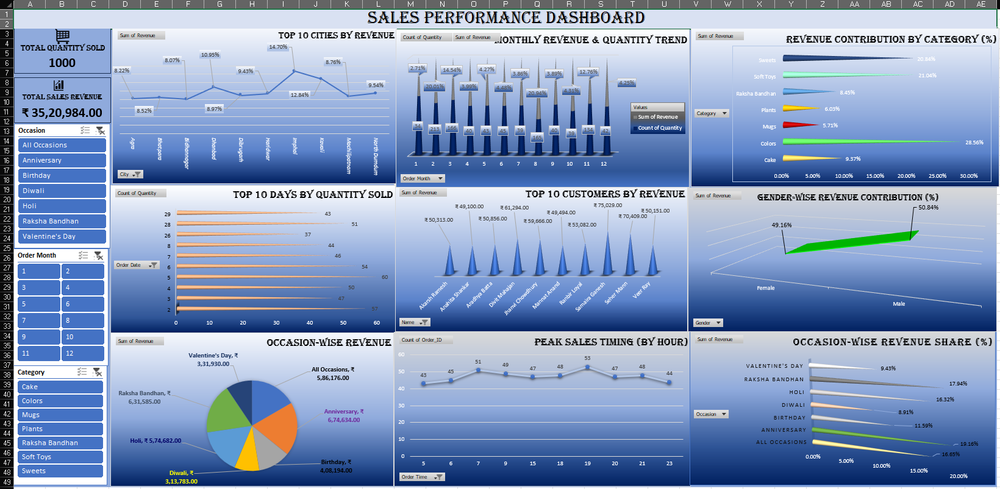

# 📊 Sales Performance Dashboard

## 🌟 Project Overview

Welcome to the **Sales Performance Dashboard**! This project is a comprehensive data visualization tool built entirely in **Microsoft Excel**. It is designed to help business owners and stakeholders track sales metrics, understand customer behavior, and optimize inventory based on seasonal trends.

The dashboard transforms raw transactional data into actionable insights using interactive **Slicers**, **Pivot Tables**, and **Dynamic Charts**.

---

## 📸 Dashboard Preview

*(Note: This is a static preview. The actual file is interactive!)*

---

## 🔑 Key Features

* **🎛️ Interactive Control Panel:** Dynamic slicers allow filtering by **Occasion** (Diwali, Holi, etc.), **Month**, and **Product Category**.
* **📈 Real-Time KPIs:** Instant view of Total Revenue (**₹35L+**) and Total Quantity Sold.
* **🌍 Geographic Insights:** Visualizes the "Top 10 Cities by Revenue" to target high-performing locations.
* **👥 Customer Segmentation:**
    * Identifies top high-value customers.
    * Analyzes Gender-wise revenue contribution (Male vs. Female).
* **📅 Temporal Analysis:**
    * **Monthly Trends:** Tracks sales spikes throughout the year.
    * **Peak Hours:** Identifies the busiest hours of the day for sales.
* **🎁 Occasion Impact:** detailed breakdown of how festivals like **Raksha Bandhan** and **Anniversaries** drive revenue.

---

## 🛠️ Tools & Technologies Used

* **Microsoft Excel 365**
* **Power Query** (For Data Cleaning & ETL)
* **Pivot Tables & Pivot Charts** (For Analysis)
* **Advanced Formulae** (SUMIFS, VLOOKUP, INDEX-MATCH)
* **Data Visualization** (3D Column Charts, Donut Charts, Area Charts)

---

## 💡 Key Insights from Analysis

1.  **Top Revenue Drivers:** The dashboard reveals that **Anniversaries** and **Raksha Bandhan** are the most profitable occasions.
2.  **Peak Timings:** Customer activity peaks significantly between **12:00 PM and 3:00 PM**.
3.  **Balanced Demographics:** Revenue contribution is nearly equal between Male (~50.8%) and Female (~49.1%) customers, suggesting a gender-neutral product appeal.
4.  **Category Leaders:** "Colors" and "Soft Toys" are among the highest-selling categories.

---

## 🚀 How to Use This File

1.  Download the `.xlsx` file from this repository.
2.  Open the file in **Microsoft Excel**.
3.  Navigate to the **"Dashboard"** sheet.
4.  Use the **Slicers** on the left panel to filter data:
    * *Click on "Diwali" to see festive sales.*
    * *Select specific months to analyze seasonal dips or spikes.*

---

## 📬 Contact

If you have any questions or want to discuss data analytics, feel free to reach out!

* **LinkedIn:** [Your Name](Your LinkedIn Profile URL)
* **Email:** [Your Email Address]

---
*Created with ❤️ and Data.*
